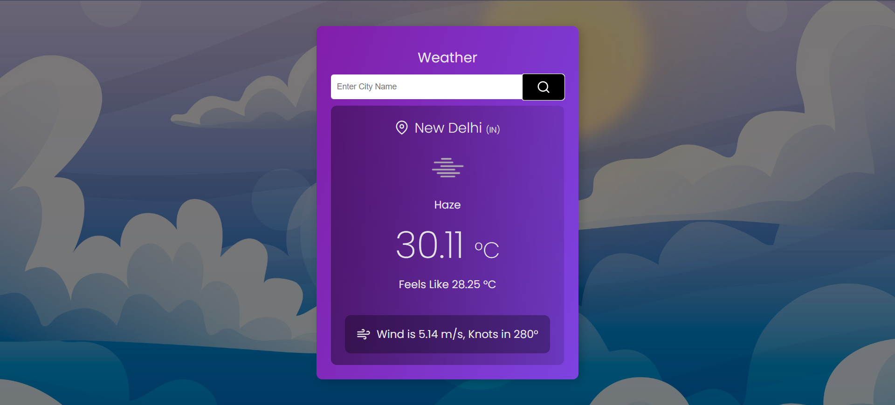

# Weather App

## Description
This is a weather app built using React and Vite. It allows users to search for a city and get the current weather data using an API.

## Features
- Search for a city to get current weather data
- Display temperature, cloud, wind speed, and weather conditions
- Responsive design

## Technologies Used
- React
- Vite
- CSS

## Installation
1. Clone the repository:
   ```
   git clone `https://github.com/SaurabhSrbjha/weather_app.git`
   ```
2. Install dependencies:
   ```
   npm install
   ```

## Usage
1. Start the development server:
   ```
   npm run dev
   ```
2. Open your web browser and navigate to `http://localhost:5173`

## API
This app uses the [OpenWeather](https://openweathermap.org/) API to fetch weather data. You will need to sign up for an API key and replace the placeholder in the code with your own API key.

## Screenshots


Search City Name : New Delhi



## Contributing
Contributions are welcome! Please open an issue or submit a pull request.

## Acknowledgements
- [React](https://reactjs.org/)
- [Vite](https://vitejs.dev/)
- [OpenWeather API](https://openweathermap.org/)
